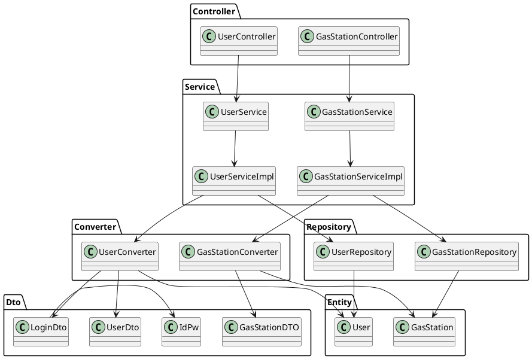

# Integration and API Test Documentation

Authors: Group 50

Date: 26 May

Version: 1.1

# Contents

- [Dependency graph](#dependency graph)

- [Integration approach](#integration)

- [Tests](#tests)

- [Scenarios](#scenarios)

- [Coverage of scenarios and FR](#scenario-coverage)
- [Coverage of non-functional requirements](#nfr-coverage)

# Dependency graph 

     
# Integration approach

	The approach is bottom up
 
	Step 1: Repository classes

	Step 2: Repository + Converters

	Step 3: Repository + Converters + Serviceimpl

#  Tests

## Step 1
| Classes  | JUnit test cases |Logical definition|
|--|--|--|
|UserRepository|testExists()|Stubs|
||testDelete()|Stubs|
||testFindAll()|Stubs|
||testFindOne()|Stubs|
||testSave()|Stubs|

## Step 2
| Classes  | JUnit test cases |Logical definition|
|--|--|--|
|UserRepository + UserConverter|testToUserDto|Stubs|
||testToUser()|Stubs|
|GasStationRepository + GasStationConverter|testToGasStationDto()|Stubs|
||testToGasStation()|Stubs|

## Step 3 API Tests

| Classes  | JUnit test cases |Logical definition|
|--|--|--|
|UserRepository + UserConverter + UserServiceimpl|testgetAllUsersEmptyDB()|Mock|
||testgetUserByIdNegativeUserId()||
||testgetUserByIdNoUsersYet()||
||testsaveUserNewUsers()||
||testGetUserById()||
||testdeleteUser()||
||testdeleteUserDoesNotExist()||
||testdeleteUserNegativeUserId()||
||testgetAllUsers()||
||testLogin()||
||testLoginNullCredentials()||
||testLoginNullEmail()||
||testLoginNullPassword()||
||testLoginNull()||
||testIncreaseUserReputationExistingUsers()||
||testIncreaseUserReputationNegativeUserId()||
||testIncreaseUserReputationReachingMax()||
||testDecreaseUserReputationExistingUsers()||
||testDecreaseUserReputationNegativeUserId()||
||testDecreaseUserReputationReachingMin()||
|GasStationRepository + GasStationConverter + GasStationServiceimpl|||
||testgetGasStationByIdEmptyDatabase()||
||testgetGasStationByIdExistingGasStation()||
||testgetGasStationByIdNegativeUserId()||
||testSaveGasStationNewOne()||
||testSaveGasStationPriceException()||
||testSaveGasStationGPSDataException()||
||testGetAllGasStations()||
||testDeleteGasStation()||
||testDeleteGasStationInvalidGasStationException()||
||testGasStationsByGasolineType()||
||testGasStationsByGasolineTypeException()||
||testgetGasStationByCarSharing()||
||testsetReport()||
||testsetReportInvalidGasStationException()||
||testsetReportInvalidUserException()||
||testgetGasStationsByProximity()||
||testgetGasStationsByProximityThrowException()||
||testgetGasStationsWithCoordinates()||
||testgetGasStationsWithCoordinatesThrowInvalidGasTypeException()||
||testgetGasStationsWithCoordinatesThrowGPSDataException()||
||testgetGasStationsWithoutCoordinates()||
||testgetGasStationsWithoutCoordinatesThrowInvalidGasTypeException()||

# Scenarios

## Scenario UC1.1

| Scenario | Create new user and update fuel price in gas station |
| ------------- |:-------------:| 
|  Precondition     | User doesn't exist |
|  Post condition     | User exists and change fuel price |
| Step#        | Description  |
|  1     | Introduce name, password email |  
|  2     | Create account saving user in databse |
|  3     | Log in with same values |
|  4     | Access to his/her account |
|  5     | Get list of all gas stations |
|  6     | Select gas station required by its id |
|  7     | Updates the fuel price in this gas station |

## Scenario UC1.2

| Scenario | Save user and cannot log in because introduces wrong password and email |
| ------------- |:-------------:| 
|  Precondition     | User doesn't exist |
|  Post condition     | User exists and cannot access to his/her account |
| Step#        | Description  |
|  1     | Introduce name, password, email |  
|  2     | Create account saving user in databse |
|  3     | Log in with the same values instead of password and email |
|  4     | Cannot access to his/her account |

## Scenario UC2.1

| Scenario | Increase user reputation |
| ------------- |:-------------:| 
|  Precondition     | Correct fuel price |
|  Post condition     | User reputation higher than before |
| Step#        | Description  |
|  1     | Log in |
|  2     | Access to his/her account |
|  3     | Get list of all gas stations |
|  4     | Select gas station required by its id and check the fuel price |
|  5     | Get list of all users |
|  6     | Select user required |
|  7     | Increase selected user reputation |

## Scenario UC2.2

| Scenario | Increase user reputation - error negative user id |
| ------------- |:-------------:| 
|  Precondition     | Correct fuel price |
|  Post condition     | Cannot find user because it's a negative id |
| Step#        | Description  |
|  1     | Log in |
|  2     | Access to his/her account |
|  3     | Get list of all gas stations |
|  4     | Select gas station required by its id and check the fuel price |
|  5     | Get list of all users |
|  6     | Select user required |
|  7     | Exception negative user id |

## Scenario UC2.3

| Scenario | Increase user reputation |
| ------------- |:-------------:| 
|  Precondition     | Wrong fuel price |
|  Post condition     | Cannot increase user reputation |
| Step#        | Description  |
|  1     | Log in |
|  2     | Access to his/her account |
|  3     | Get list of all gas stations |
|  4     | Select gas station required by its id and check the fuel price |
|  5     | Get list of all users |
|  6     | Select user required |
|  7     | Decrease selected user reputation |

## Scenario UC3.1

| Scenario | Delete user |
| ------------- |:-------------:| 
|  Precondition     | User exists |
|  Post condition     | User doesn't exist |
| Step#        | Description  |
|  1     | Log in |
|  2     | Access to his/her account |
|  3     | Delete his/her account |

## Scenatio UC3.2

| Scenario | Delete gas Station |
| ------------- |:-------------:| 
|  Precondition     | Gas station exists |
|  Post condition     | Gas station doesn't exist |
| Step#        | Description  |
|  1     | Log in |
|  2     | Access to his/her account |
|  3     | Get lis of all gas stations |
|  4     | Select gas station by id |
|  5     | Delete gas station |

## Scenario UC3.3

| Scenario | Delete gas Station - Error invalid gas station |
| ------------- |:-------------:| 
|  Precondition     | Gas station exists |
|  Post condition     | Gas station still exist because introduced a negative id |
| Step#        | Description  |
|  1     | Log in |
|  2     | Access to his/her account |
|  3     | Get lis of all gas stations |
|  4     | Select gas station by id |
|  5     | Delete gas station |
|  6     | Exception invalid gas station |

# Coverage of Scenarios and FR

| Scenario ID | Functional Requirements covered | JUnit  Test(s) | 
| ----------- | ------------------------------- | ----------- | 
|  1.1        | FR1.1, FR3.3, FR5.1             | testsaveUserNewUsers(), testsetReport() |             
|  1.2        | FR1.1, FR2                      | testsaveUserNewUsers(), testLogin() |                      
|  2.1        | Not included in the official requirements                               | testIncreaseUserReputationExistingUsers() |             
|  2.2        | Not included in the official requirements                                | testIncreaseUserReputationNegativeUserId() |      
|  2.3        | Not included in the official requirements                                | testDecreaseUserReputationExistingUsers() |
|  3.1        | FR1.2                           | testdeleteUser() |             
|  3.2        | FR3.2                           | testDeleteGasStation() |            
|  3.3        | FR3.2                           | testDeleteGasStationInvalidGasStationException() |   

# Coverage of Non Functional Requirements

### 

| Non Functional Requirement | Test name |
| -------------------------- | --------- |
|        Response Time                    |    All JUnit tests executed less than 0.5s     |

