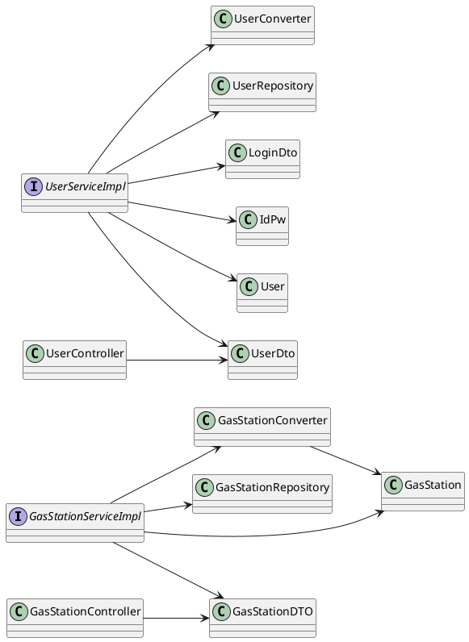

# Integration and API Test Documentation

Authors:

Date:

Version:

# Contents

- [Dependency graph](#dependency graph)

- [Integration approach](#integration)

- [Tests](#tests)

- [Scenarios](#scenarios)

- [Coverage of scenarios and FR](#scenario-coverage)
- [Coverage of non-functional requirements](#nfr-coverage)

# Dependency graph 

     
# Integration approach

    <Write here the integration sequence you adopted, in general terms (top down, bottom up, mixed) and as sequence
    (ex: step1: class A, step 2: class A+B, step 3: class A+B+C, etc)> 
    <The last integration step corresponds to API testing at level of Service package>
    <Tests at level of Controller package will be done later>

#  Tests

   <define below a table for each integration step. For each integration step report the group of classes under test, and the names of
     JUnit test cases applied to them>

## Step 1
| Classes  | JUnit test cases |Logical definition|
|--|--|--|
||||

## Step 2
| Classes  | JUnit test cases |Logical definition|
|--|--|--|
||||

## Step n API Tests

   <The last integration step  should correspond to API testing, or tests applied to all classes implementing the APIs defined in the Service package>

| Classes  | JUnit test cases |Logical definition|
|--|--|--|
||||

# Scenarios

<If needed, define here additional scenarios for the application. Scenarios should be named
 referring the UC they detail>

## Scenario UC1.1

| Scenario | Create new user and update fuel price in gas station |
| ------------- |:-------------:| 
|  Precondition     | User doesn't exist |
|  Post condition     | User exists and change fuel price |
| Step#        | Description  |
|  1     | Introduce name, password email |  
|  2     | Create account saving user in databse |
|  3     | Log in with same values |
|  4     | Access to his/her account |
|  5     | Get list of all gas stations |
|  6     | Select gas station required by its id |
|  7     | Updates the fuel price in this gas station |

## Scenario UC1.2

| Scenario | Save user and cannot log in because introduces wrong password and email |
| ------------- |:-------------:| 
|  Precondition     | User doesn't exist |
|  Post condition     | User exists and cannot access to his/her account |
| Step#        | Description  |
|  1     | Introduce name, password, email |  
|  2     | Create account saving user in databse |
|  3     | Log in with the same values instead of password and email |
|  4     | Cannot access to his/her account |

## Scenario UC2.1

| Scenario | Increase user reputation |
| ------------- |:-------------:| 
|  Precondition     | Correct fuel price |
|  Post condition     | User reputation higher than before |
| Step#        | Description  |
|  1     | Log in |
|  2     | Access to his/her account |
|  3     | Get list of all gas stations |
|  4     | Select gas station required by its id and check the fuel price |
|  5     | Get list of all users |
|  6     | Select user required |
|  7     | Increase selected user reputation |

## Scenario UC2.2

| Scenario | Increase user reputation - error negative user id |
| ------------- |:-------------:| 
|  Precondition     | Correct fuel price |
|  Post condition     | Cannot find user because it's a negative id |
| Step#        | Description  |
|  1     | Log in |
|  2     | Access to his/her account |
|  3     | Get list of all gas stations |
|  4     | Select gas station required by its id and check the fuel price |
|  5     | Get list of all users |
|  6     | Select user required |
|  7     | Exception negative user id |

## Scenario UC2.3

| Scenario | Increase user reputation |
| ------------- |:-------------:| 
|  Precondition     | Wrong fuel price |
|  Post condition     | Cannot increase user reputation |
| Step#        | Description  |
|  1     | Log in |
|  2     | Access to his/her account |
|  3     | Get list of all gas stations |
|  4     | Select gas station required by its id and check the fuel price |
|  5     | Get list of all users |
|  6     | Select user required |
|  7     | Decrease selected user reputation |

## Scenario UC3.1

| Scenario | Delete user |
| ------------- |:-------------:| 
|  Precondition     | User exists |
|  Post condition     | User doesn't exist |
| Step#        | Description  |
|  1     | Log in |
|  2     | Access to his/her account |
|  3     | Delete his/her account |

## Scenatio UC3.2

| Scenario | Delete gas Station |
| ------------- |:-------------:| 
|  Precondition     | Gas station exists |
|  Post condition     | Gas station doesn't exist |
| Step#        | Description  |
|  1     | Log in |
|  2     | Access to his/her account |
|  3     | Get lis of all gas stations |
|  4     | Select gas station by id |
|  5     | Delete gas station |

## Scenario UC3.3

| Scenario | Delete gas Station - Error invalid gas station |
| ------------- |:-------------:| 
|  Precondition     | Gas station exists |
|  Post condition     | Gas station still exist because introduced a negative id |
| Step#        | Description  |
|  1     | Log in |
|  2     | Access to his/her account |
|  3     | Get lis of all gas stations |
|  4     | Select gas station by id |
|  5     | Delete gas station |
|  6     | Exception invalid gas station |

# Coverage of Scenarios and FR

<Report in the following table the coverage of  scenarios (from official requirements and from above) vs FR. 
Report also for each of the scenarios the (one or more) API JUnit tests that cover it. >

| Scenario ID | Functional Requirements covered | JUnit  Test(s) | 
| ----------- | ------------------------------- | ----------- | 
|  1.1        | FR1.1, FR3.3, FR5.1             | testsaveUserNewUsers() |             
|  1.2        | FR1.1, FR2                      | testsaveUserNewUsers(), testLogin() |                      
|  2.1        | ?                               | testIncreaseUserReputationExistingUsers() |             
|  2.2        | ?                               | testIncreaseUserReputationNegativeUserId() |      
|  2.3        | ?                               | testDecreaseUserReputationExistingUsers() |
|  3.1        | FR1.2                           | testdeleteUser() |             
|  3.2        | FR3.2                           | testDeleteGasStation() |            
|  3.3        | FR3.2                           | testDeleteGasStationInvalidGasStationException() |   

# Coverage of Non Functional Requirements

<Report in the following table the coverage of the Non Functional Requirements of the application - only those that can be tested with automated testing frameworks.>

### 

| Non Functional Requirement | Test name |
| -------------------------- | --------- |
|        Response Time                    |           |

