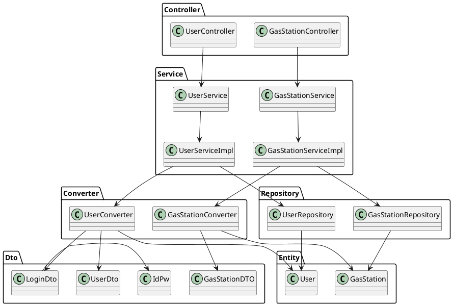

# Integration and API Test Documentation

Authors: Group 50

Date: 26 May

Version: 1.1

# Contents

- [Dependency graph](#dependency graph)

- [Integration approach](#integration)

- [Tests](#tests)

- [Scenarios](#scenarios)

- [Coverage of scenarios and FR](#scenario-coverage)
- [Coverage of non-functional requirements](#nfr-coverage)

# Dependency graph 

     
# Integration approach

	The approach is bottom up
 
	Step 1: Repository classes

	Step 2: Repository + Converters

	Step 3: Repository + Converters + Serviceimpl

#  Tests

## Step 1
| Classes  | JUnit test cases |Logical definition|
|--|--|--|
|UserRepository|testExists()|Stubs|
||testDelete()|Stubs|
||testFindAll()|Stubs|
||testFindOne()|Stubs|
||testSave()|Stubs|
|GasStationRepository|testExist()|Stubs|
||testDelete()|Stubs|
||testFindAll()|Stubs|
||testfindOne()|Stubs|
||testsave()|Stubs|

## Step 2
| Classes  | JUnit test cases |Logical definition|
|--|--|--|
|UserRepository + UserConverter|testToUserDto()|Stubs|
||testToUser()|Stubs|
|GasStationRepository + GasStationConverter|testToGasStationDto()|Stubs|
||testToGasStation()|Stubs|

## Step 3 API Tests

| Classes  | JUnit test cases |Logical definition|
|--|--|--|
|UserRepository + UserConverter + UserServiceimpl|testgetAllUsersEmptyDB()|Mock|
||testgetUserByIdNegativeUserId()||
||testgetUserByIdNoUsersYet()||
||testsaveUserNewUsers()||
||testGetUserById()||
||testdeleteUser()||
||testdeleteUserDoesNotExist()||
||testdeleteUserNegativeUserId()||
||testgetAllUsers()||
||testLogin()||
||testLoginNullCredentials()||
||testLoginNullEmail()||
||testLoginNullPassword()||
||testLoginNull()||
||testIncreaseUserReputationExistingUsers()||
||testIncreaseUserReputationNegativeUserId()||
||testIncreaseUserReputationReachingMax()||
||testDecreaseUserReputationExistingUsers()||
||testDecreaseUserReputationNegativeUserId()||
||testDecreaseUserReputationReachingMin()||
|GasStationRepository + GasStationConverter + GasStationServiceimpl|testgetGasStationByIdEmptyDatabase()|Mock|
||testgetGasStationByIdExistingGasStation()||
||testgetGasStationByIdNegativeUserId()||
||testSaveGasStationNewOne()||
||testSaveGasStationPriceException()||
||testSaveGasStationGPSDataException()||
||testGetAllGasStations()||
||testDeleteGasStation()||
||testDeleteGasStationInvalidGasStationException()||
||testGasStationsByGasolineType()||
||testGasStationsByGasolineTypeException()||
||testgetGasStationByCarSharing()||
||testsetReport()||
||testsetReportInvalidGasStationException()||
||testsetReportInvalidUserException()||
||testgetGasStationsByProximity()||
||testgetGasStationsByProximityThrowException()||
||testgetGasStationsWithCoordinates()||
||testgetGasStationsWithCoordinatesThrowInvalidGasTypeException()||
||testgetGasStationsWithCoordinatesThrowGPSDataException()||
||testgetGasStationsWithoutCoordinates()||
||testgetGasStationsWithoutCoordinatesThrowInvalidGasTypeException()||

# Scenarios

## Scenario UC1.1
| Scenario | Create user account |
| ------------- |:-------------:| 
|  Precondition     | User doesn't have an account |
|  Post condition     | User has an account |
| Step#        | Description  |
|  1     | User introduces email, password, name |  
|  2     | Account is created successfully |

## Scenario UC1.2
| Scenario | Create another user account with same email |
| ------------- |:-------------:| 
|  Precondition     | User has an account |
|  Post condition     | Don't create a new account |
| Step#        | Description  |
|  1     | User introduces same email |  
|  2     | Account isn't created because this user is already in the database |

## Scenario UC2.1
| Scenario | Modify user account |
| ------------- |:-------------:| 
|  Precondition     | User wants to change some fields in his/her account |
|  Post condition     | User updates the account |
| Step#        | Description  |
|  1     | User logs in his/her account |  
|  2     | User change fields in his/her account |
|  3     | Account is updated successfully |

## Scenario UC2.2
| Scenario | Administrator modifies user account |
| ------------- |:-------------:| 
|  Precondition     | Admin wants to change some fields in U account |
|  Post condition     | Admin updates U account |
| Step#        | Description  |
|  1     | Admin logs in his/her account | 
|  2     | Admin looks for user | 
|  3     | Admin change some fields in user account |
|  4     | Account is update successfully |

## Scenario UC3.1
| Scenario | Delete user account |
| ------------- |:-------------:| 
|  Precondition     | User wants to delete his/her account |
|  Post condition     | User account doen't exist |
| Step#        | Description  |
|  1     | User logs in his/her account |  
|  2     | User deletes his/her account successfully |

## Scenario UC3.2
| Scenario | Admin deletes user account |
| ------------- |:-------------:| 
|  Precondition     | Admin wants to delete user account |
|  Post condition     | User account doen't exist |
| Step#        | Description  |
|  1     | Admin logs in his/her account |  
|  2     | Admin looks for user |
|  3     | Admin deletes user account successfully |

## Scenario UC4.1
| Scenario | Create gas station |
| ------------- |:-------------:| 
|  Precondition     | Gas station doesn't exist |
|  Post condition     | Gas station exist |
| Step#        | Description  |
|  1     | Admin logs in his/her account |  
|  2     | Admin introduce all the information about the gas station |
|  3     | Gas station is created successfully |

## Scenario UC5.1
| Scenario | Modify Gas Station information |
| ------------- |:-------------:| 
|  Precondition     | Admin wants to change some properties of the gas station |
|  Post condition     | Admin updates gas station properties |
| Step#        | Description  |
|  1     | Admin logs in his/her account |  
|  2     | Admin looks for the gas station |
|  3     | Admin updates gas station properties successfully |

## Scenario UC6.1
| Scenario | Delete Gas Station |
| ------------- |:-------------:| 
|  Precondition     | Admin wants to delete a gas station |
|  Post condition     | Gas station is deleted |
| Step#        | Description  |
|  1     | Admin logs in his/her account |  
|  2     | Admin looks for the gas station |
|  3     | Admin deletes gas station successfully |

## Scenario UC7.1
| Scenario | Report fuel price for a gas station |
| ------------- |:-------------:| 
|  Precondition     | User wants to report fuel price for a gas station |
|  Post condition     | Fuel price of gas staton is inserted |
| Step#        | Description  |
|  1     | User logs in his/her account |  
|  2     | User looks for gas station |
|  3     | User adds fuel prices | 

## Scenario UC7.2
| Scenario | Report fuel price for a gas station that already exist |
| ------------- |:-------------:| 
|  Precondition     | User wants to report fuel price for a gas station |
|  Post condition     | Fuel price of G is inserted |
| Step#        | Description  |
|  1     | User logs in his/her account |  
|  2     | User looks for gas station |
|  3     | User updates fuel prices |

## Scenario UC8.1
| Scenario | Obtain price of fuel for gas stations in a certain geographic area |
| ------------- |:-------------:| 
|  Precondition     | Anonymous user AU wants to check fuel price by geopoint GP |
|  Post condition     | Fuel price of gas station is shown |
| Step#        | Description  |
|  1     | AU selects a GP |  
|  2     | AU looks for gas station in the radius of GP |
|  3     | AU gets fuel prices |
|  4     | AU updates fuel prices if it's null |

## Scenario UC8.2
| Scenario | Obtain price of fuel type for gas stations in a certain geographic area |
| ------------- |:-------------:| 
|  Precondition     | Anonymous user AU wants to check fuel price |
|  Post condition     | Fuel price of gas station is shown |
| Step#        | Description  |
|  1     | AU selects a GP |  
|  2     | AU looks for gas station in the radius of GP with this fuel type |
|  3     | AU gets fuel prices |
|  4     | AU updates fuel prices if it's null |

## Scenario UC8.3
| Scenario | Obtain price of fuel for gas stations in a certain geographic area and car sharing |
| ------------- |:-------------:| 
|  Precondition     | Anonymous user AU wants to check fuel price by car sharing |
|  Post condition     | Fuel price of gas station is shown |
| Step#        | Description  |
|  1     | AU selects a GP |  
|  2     | AU looks for gas station in the radius of GP with this car sharing |
|  3     | AU gets fuel prices |
|  4     | AU updates fuel prices if it's null |

## Scenario UC8.4
| Scenario | Obtain price of fuel for gas stations in a certain geographic area sorted by price |
| ------------- |:-------------:| 
|  Precondition     | Anonymous user AU wants to check fuel price shorted by price |
|  Post condition     | Fuel price of gas station is shown |
| Step#        | Description  |
|  1     | AU selects a GP |  
|  2     | AU looks for gas station in the radius of GP |
|  3     | AU gets fuel prices |
|  4     | AU updates fuel prices if it's null |

## Scenario UC8.5
| Scenario | Obtain price of fuel for gas stations in a certain geographic area sorted by discance |
| ------------- |:-------------:| 
|  Precondition     | Anonymous user AU wants to check fuel price by proximity |
|  Post condition     | Fuel price of gas station is shown |
| Step#        | Description  |
|  1     | AU selects a GP |  
|  2     | AU looks for gas station in the radius of GP sorted by distance |
|  3     | AU gets fuel prices |
|  4     | AU updates fuel prices if it's null |

## Scenario UC9.1
| Scenario | Update trust level of price list |
| ------------- |:-------------:| 
|  Precondition     | Anonymous user AU updates fuel price |
|  Post condition     | Trust level of price list is updated |
| Step#        | Description  |
|  1     | AU selects fuel in a gas station |  
|  2     | AU updates fuel price |
|  3     | System calculates and update trust level of price list |

# Coverage of Scenarios and FR

| Scenario ID | Functional Requirements covered | JUnit  Test(s) | 
| ----------- | ------------------------------- | ----------- | 
|  1.1        | FR1.1, FR3.3, FR5.1             | testsaveUserNewUsers(), testsetReport() |             
|  1.2        | FR1.1, FR2                      | testsaveUserNewUsers(), testLogin() |                      
|  2.1        | Not included in the official requirements                               | testIncreaseUserReputationExistingUsers() |             
|  2.2        | Not included in the official requirements                                | testIncreaseUserReputationNegativeUserId() |      
|  3.1        | Not included in the official requirements                                | testDecreaseUserReputationExistingUsers() |
|  3.2        | FR1.2                           | testdeleteUser() |             
|  4.1        | FR3.2                           | testDeleteGasStation() |            
|  5.1        | FR3.2                           | testDeleteGasStationInvalidGasStationException() |   
|  6.1        | FR3.2                           | testDeleteGasStationInvalidGasStationException() |   
|  7.1        | FR3.2                           | testDeleteGasStationInvalidGasStationException() |   
|  7.2        | FR3.2                           | testDeleteGasStationInvalidGasStationException() | 
|  7.2        | FR3.2                           | testDeleteGasStationInvalidGasStationException() | 
|  7.2        | FR3.2                           | testDeleteGasStationInvalidGasStationException() | 
|  7.2        | FR3.2                           | testDeleteGasStationInvalidGasStationException() | 

# Coverage of Non Functional Requirements

### 

| Non Functional Requirement | Test name |
| -------------------------- | --------- |
|        Response Time                    |    All JUnit tests executed less than 0.5s     |

