# Integration and API Test Documentation

Authors:

Date:

Version:

# Contents

- [Dependency graph](#dependency graph)

- [Integration approach](#integration)

- [Tests](#tests)

- [Scenarios](#scenarios)

- [Coverage of scenarios and FR](#scenario-coverage)
- [Coverage of non-functional requirements](#nfr-coverage)

# Dependency graph 

```plantuml
scale 8192*1536 
left to right direction
@startuml
package BackEnd {
package "it.polito.ezgas.service" {
   interface UserService {
     +UserDto getUserById(Integer userId)
     +UserDto saveUser(UserDto userDto)
     +List<UserDto> getAllUsers()
     +boolean deleteUser(Integer userId)
     +LoginDto login(IdPw credentials)
     +Integer increaseUserReputation(Integer userId)
     +Integer decreaseUserReputation(Integer userId)
   }

   interface GasStationService {
     +GasStationDto getGasStationById(Integer gasStationId)
     +GasStationDto saveGasStation(GasStationDto gasStationDto)
     +List<GasStationDto> getAllGasStations()
     +boolean deleteGasStation(Integer gasStationId)
     +List<GasStationDto> getGasStationsByGasolineType(String gasolinetype)
     +List<GasStationDto> getGasStationsByProximity(double lat, double lon)
     +List<GasStationDto> getGasStationsWithCoordinates(double lat, double lon, String gasolinetype, String carsharing)
     +List<GasStationDto> getGasStationsWithoutCoordinates(String gasolinetype, String carsharing)
     +void setReport(Integer gasStationId, double dieselPrice, double superPrice, double superPlusPrice, double gasPrice, double methanePrice, Integer userId)
     +List<GasStationDto> getGasStationByCarSharing(String carSharing)
   }

}

package "it.polito.ezgas.repository" {
class UserRepository {
     +save(User user)
     +findOne(Integer userId)
     +findAll()
     +exists(Integer UserId)
     +delete(Integer UserId)
   }
   class GasStationRepository {
     +save(GasStation gasStation)
     +findOne(Integer gasStationId)
     +findAll()
     +exists(Integer gasStationId)
     +delete(Integer gasStationId)
   }

}

package "it.polito.ezgas.converter" {

class UserConverter {
     User user
     UserDto userDto
     __
     +UserDto toUserDto(User userSource)
     +User toUser(UserDto userDtoSource)
 }
   class GasStationConverter {
     GasStation gasStation
     GasStationDto gasStationDto
     UserConverter userConverter
     __
     +GasStationDto toGasStationDto(GasStation gasStationSource)
     +GasStation toGasStation(GasStationDto gasStationDtoSource)
 }
}


package "it.polito.ezgas.dto" {
  class UserDto {
    Integer userId
    String userName
    String password
    String email
    Integer reputation
    boolean admin
    __
    +Integer getUserId()
    +void setUserId(Integer userId)
    +String getUserName()
    +void setUserName(String userName)
    +void setPassword(String password)
    +String getPassword()
    +String getEmail()
    +void setEmail(String email)
    +Integer getReputation()
    +void setReputation(Integer reputation)
    +boolean getAdmin()
    +void setAdmin(boolean admin)
  }
  class GasStationDto {
    Integer gasStationId
    String gasStationName
    String gasStationAddress
    boolean hasDiesel
    boolean hasSuper
    boolean hasSuperPlus
    boolean hasGas
    booelan hasMethane
    String carSharing
    double lat
    double lon
    double dieselPrice
    double superPrice
    double superPlusPrice
    double gasPrice
    double methanePrice
    Integer reportUser
    String reportTimestamp
    double reportDependability
    UserDto userDto
    __
    +Integer getGasStationId()
    +void setGasStationId(Integer gasStationId)
    +String getGasStationName()
    +void setGasStationName(String gasStationName)
    +String getGasStationAddress()
    +void setGasStationAddress(String gasStationAddress)
    +double getReportDependability()
    +void setReportDependability(double reportDependability)
    +Integer getReportUser()
    +void setReportUser(Integer reportUser)
    +String getReportTimestamp()
    +void setReportTimestamp(String reportTimestamp)
    +boolean getHasDiesel()
    +void setHasDiesel(boolean hasDiesel)
    +boolean getHasSuper()
    +void setHasSuper(boolean hasSuper)
    +boolean getHasSuperPlus()
    +void setHasSuperPlus(boolean hasSuperPlus)
    +boolean getHasGas()
    +void setHasGas(boolean hasGas)
    +double getLat()
    +void setLat(double lat)
    +double getLon()
    +void setLon(double lon)
    +double getDieselPrice()
    +void setDieselPrice(double dieselPrice)
    +double getSuperPrice()
    +void setSuperPrice(double superPrice)
    +double getSuperPlusPrice()
    +void setSuperPlusPrice(double superPlusPrice)
    +double getGasPrice()
    +void setGasPrice(double gasPrice)
    +User getUserDto()
    +void setUserDto(User userDto)
    +boolean getHasMethane()
    +void setHasMethane(boolean hasMethane)
    +double getMethanePrice()
    +void setMethanePrice(double methanePrice)
    +String getCarSharing()
    +void setCarSharing(String carSharing)
  }
  class LoginDto {
    Integer userId
    String userName
    String token
    String email
    Integer reputation
    boolean admin
    __
    +Integer getUserId()
    +void setUserId(Integer userId)
    +String getUserName()
    +void setUserName(String userName)
    +String getToken()
    +void setToken(String token)
    +String getEmail()
    +void setEmail(String email)
    +Integer getReputation()
    +void setReputation(Integer reputation)
    +boolean getAdmin()
    +void setAdmin(Boolean admin)
  }
  class IdPw {
    String user
    String pw
    __
    +String getUser()
    +void setUser(String user)
    +String getPw()
    +void setPw(String pw)
  }
}

package "it.polito.ezgas.entity" {
   class User {
    Integer userId
    String userName
    String password
    String email
    Integer reputation
    boolean admin
    __
    +Integer getUserId()
    +void setUserId(Integer userId)
    +String getUserName()
    +void setUserName(String userName)
    +void setPassword(String password)
    +String getPassword()
    +String getEmail()
    +void setEmail(String email)
    +Integer getReputation()
    +void setReputation(Integer reputation)
    +boolean getAdmin()
    +void setAdmin(boolean admin)
  }
  class GasStation {
    Integer gasStationId
    String gasStationName
    String gasStationAddress
    boolean hasDiesel
    boolean hasSuper
    boolean hasSuperPlus
    boolean hasGas
    booelan hasMethane
    String carSharing
    double lat
    double lon
    double dieselPrice
    double superPrice
    double superPlusPrice
    double gasPrice
    double methanePrice
    Integer reportUser
    String reportTimestamp
    double reportDependability
    User user
    __
    +Integer getGasStationId()
    +void setGasStationId(Integer gasStationId)
    +String getGasStationName()
    +void setGasStationName(String gasStationName)
    +String getGasStationAddress()
    +void setGasStationAddress(String gasStationAddress)
    +double getReportDependability()
    +void setReportDependability(double reportDependability)
    +Integer getReportUser()
    +void setReportUser(Integer reportUser)
    +String getReportTimestamp()
    +void setReportTimestamp(String reportTimestamp)
    +boolean getHasDiesel()
    +void setHasDiesel(boolean hasDiesel)
    +boolean getHasSuper()
    +void setHasSuper(boolean hasSuper)
    +boolean getHasSuperPlus()
    +void setHasSuperPlus(boolean hasSuperPlus)
    +boolean getHasGas()
    +void setHasGas(boolean hasGas)
    +double getLat()
    +void setLat(double lat)
    +double getLon()
    +void setLon(double lon)
    +double getDieselPrice()
    +void setDieselPrice(double dieselPrice)
    +double getSuperPrice()
    +void setSuperPrice(double superPrice)
    +double getSuperPlusPrice()
    +void setSuperPlusPrice(double superPlusPrice)
    +double getGasPrice()
    +void setGasPrice(double gasPrice)
    +User getUser()
    +void setUser(User user)
    +boolean getHasMethane()
    +void setHasMethane(boolean hasMethane)
    +double getMethanePrice()
    +void setMethanePrice(double methanePrice)
    +String getCarSharing()
    +void setCarSharing(String carSharing)
  }
}
}
User "1" -- "1" UserDto
GasStation "1" -- "1" GasStationDto
UserConverter "1" -- "0..*" User
UserConverter "1" -- "0..*" UserDto
UserConverter "1" -- "1" UserService
GasStationConverter "1" -- "1" GasStationService
GasStationConverter "1" -- "0..*" GasStation
GasStationConverter "1" -- "0..*" GasStationDto
User "0..*" -- "1" UserRepository
GasStation "0..*" -- "1" GasStationRepository
GasStationRepository "1" -- "1" UserRepository
IdPw "1" -- "1" LoginDto
@enduml
```

     
# Integration approach

    <Write here the integration sequence you adopted, in general terms (top down, bottom up, mixed) and as sequence
    (ex: step1: class A, step 2: class A+B, step 3: class A+B+C, etc)> 
    <The last integration step corresponds to API testing at level of Service package>
    <Tests at level of Controller package will be done later>

#  Tests

   <define below a table for each integration step. For each integration step report the group of classes under test, and the names of
     JUnit test cases applied to them>

## Step 1
| Classes  | JUnit test cases |Logical definition|
|--|--|--|
||||

## Step 2
| Classes  | JUnit test cases |Logical definition|
|--|--|--|
||||

## Step n API Tests

   <The last integration step  should correspond to API testing, or tests applied to all classes implementing the APIs defined in the Service package>

| Classes  | JUnit test cases |Logical definition|
|--|--|--|
||||

# Scenarios

<If needed, define here additional scenarios for the application. Scenarios should be named
 referring the UC they detail>

## Scenario UC1.1

| Scenario | Save new user and log in |
| ------------- |:-------------:| 
|  Precondition     | user doesn't exist |
|  Post condition     | user exists and can access to his/her account |
| Step#        | Description  |
|  1     | Introduce name, password email |  
|  2     | Create account saving user in databse |
|  3     | Log in with the same values |
|  4     | Access to his/her account |

##Scenarion UC1.2

| Scenario | Save new user and cannot log in because he/she introduces wrong password |
| ------------- |:-------------:| 
|  Precondition     | user doesn't exist |
|  Post condition     | user exists and cannot access to his/her account |
| Step#        | Description  |
|  1     | Introduce name, password, email |  
|  2     | Create account saving user in databse |
|  3     | Log in with the same values instead of password |
|  4     | Cannot access to his/her account |

##Scenario UC1.3

| Scenario | Save new user and cannot log in because he/she introduces wrong email |
| ------------- |:-------------:| 
|  Precondition     | user doesn't exist |
|  Post condition     | user exists and cannot access to his/her account |
| Step#        | Description  |
|  1     | Introduce name, password, email |  
|  2     | Create account saving user in databse |
|  3     | Log in with the same values instead of email|
|  4     | Cannot access to his/her account |

##Scenario UC1.4

| Scenario | Save new user and cannot log in because he/she introduces wrong password and email |
| ------------- |:-------------:| 
|  Precondition     | user doesn't exist |
|  Post condition     | user exists and cannot access to his/her account |
| Step#        | Description  |
|  1     | Introduce name, password, email |  
|  2     | Create account saving user in databse |
|  3     | Log in with the same values instead of password and email |
|  4     | Cannot access to his/her account |

##Scenario UC2.1

| Scenario | Increase user reputation |
| ------------- |:-------------:| 
|  Precondition     | user reputation lower than after |
|  Post condition     | user reputation higher than before |
| Step#        | Description  |
|  1     | Look for the user who wants to increase his/her reputation in the list |  
|  2     | Select it |
|  3     | increase his/her reputation |

##Scenario UC2.2

| Scenario |  Increase user reputation - error negative Id |
| ------------- |:-------------:| 
|  Precondition     | user reputation lower than after |
|  Post condition     | cannot increase user reputation |
| Step#        | Description  |
|  1     | Look for the user who wants to increase his/her reputation in the list |  
|  2     | Select it |
|  3     | cannot increase his/her reputation because the id is negative|

# Coverage of Scenarios and FR

<Report in the following table the coverage of  scenarios (from official requirements and from above) vs FR. 
Report also for each of the scenarios the (one or more) API JUnit tests that cover it. >

| Scenario ID | Functional Requirements covered | JUnit  Test(s) | 
| ----------- | ------------------------------- | ----------- | 
|  ..         | FRx                             |             |             
|  ..         | FRy                             |             |             
| ...         |                                 |             |             
| ...         |                                 |             |             
| ...         |                                 |             |             
| ...         |                                 |             |             

# Coverage of Non Functional Requirements

<Report in the following table the coverage of the Non Functional Requirements of the application - only those that can be tested with automated testing frameworks.>

### 

| Non Functional Requirement | Test name |
| -------------------------- | --------- |
|        Response Time                    |           |

