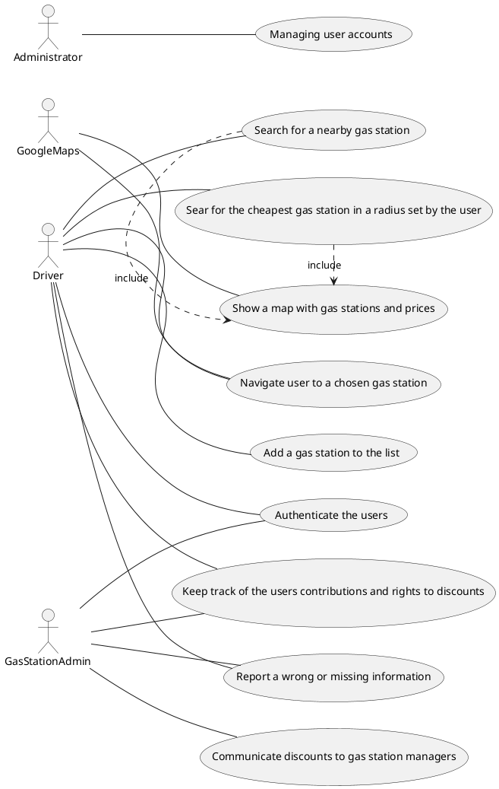
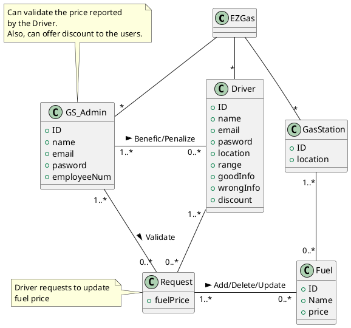
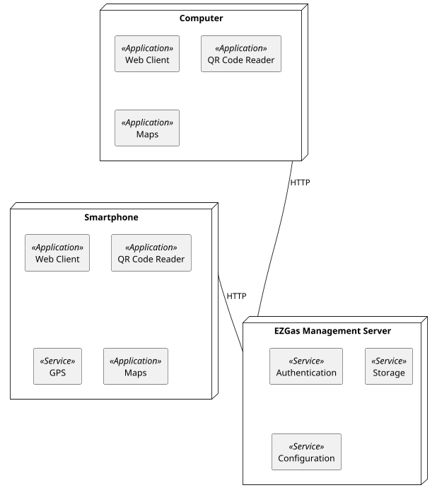

# Requirements Document 

Authors: Fereshteh Feizabadi

Date: 17 April 2020

Version: 1

# Contents

- [Stakeholders](#stakeholders)
- [Context Diagram and interfaces](#context-diagram-and-interfaces)
	+ [Context Diagram](#context-diagram)
	+ [Interfaces](#interfaces) 
	
- [Stories and personas](#stories-and-personas)
- [Functional and non functional requirements](#functional-and-non-functional-requirements)
	+ [Functional Requirements](#functional-requirements)
	+ [Non functional requirements](#non-functional-requirements)
- [Use case diagram and use cases](#use-case-diagram-and-use-cases)
	+ [Use case diagram](#use-case-diagram)
	+ [Use cases](#use-cases)
    	+ [Relevant scenarios](#relevant-scenarios)
- [Glossary](#glossary)
- [System design](#system-design)
- [Deployment diagram](#deployment-diagram)


# Stakeholders

| Stakeholder name  | Description | 
| ----------------- |:-----------:|
|        Driver           |      Uses the application for checking and updating the prices of fuels in different gas stations | 
|        Gas station administrator           |      Uses the application for updating the prices of the fuels and offers discount       |
|        Developer           |      Develops the application        |
|        Administrator	           |      Application administrator, IT administrator, DB administrator     |


# Context Diagram and interfaces

## Context Diagram

```plantuml
left to right direction
actor Driver as a
actor GasStationAdmin as b
actor Administrator as c
actor Google map as d

rectangle System {
a -- (Ez Gas Application)
b -- (Ez Gas Application)
c -- (Ez Gas Application)
d -- (Ez Gas Application)

}
```


## Interfaces


| Actor | Logical Interface | Physical Interface  |
| ------------- |:-------------:| -----:|
|    Driver   | GUI | Touch screen |
|    Gas station administrator   | GUI | Touch screen |
|    Google Map   | Web Service | Internet connection |
|    Administrator   | GUI | Mouse and Keyboard |

# Stories and personas
Peter is a plumber and travels a lot on his LPG van for work in differend towns, up to hundreds of kilometers a day. He knows all the best gas station on his usual routes but work sometimes takes in other cities he doesnt know very well. Peter pays attention to the price of LPG so he uses EzGaz to find a cheap gas station with LPG in a 5 km range, or further but on his way home. One day he goes a bit out of his way to fill the tank on a very cheap gas station he found with EzGaz, but when he gets there the actual price is higher than advertised so he reports it on the app  he reports it on the app and he will receive a discount for his contribution. After making a few true reports like that Peter becomes a trusted user.

Janice works in upper managment of a big company and drives a Porches. On tuesdays after work she has to pick up her son from piano practice, and is usually in a hurry. When she sees the gas tank almost empty she would uses find the nearest gas station and doesn't care about the price because she is running late.

Frank just opened a gas station very close to a big intersection but not quite visible from the road, so he added his gas station in EzGaz to advertise with offering discount. Many people come to his gas station with discount codes on their phones for a small reduction on the fuel, which is worth because of the many new clients he gets.


# Functional and non functional requirements

## Functional Requirements

| ID        | Description  |
| ------------- |:-------------:|  
|  FR1     | Searching for a nearby gas station ( using the GPS position ) |
|  FR2     | Searching for the cheapest gas station( for a certain type of fuel ) in a radius set by the user |
|  FR3     | Showing a map with gas stations and their prices |
|  FR4     | Navigate the user to a chosen gas station |
|  FR5     | Authenticatig the users ( differentiating the gas station Admins and trusted users ) |
|  FR6     | Adding a gas station to the list |
|  FR7     | Reporting a wrong or missing information |
|  FR8     | Keeping track of the users' contributions and rights to discounts |
|  FR9     | Keeping track of earned discounts and allowing users to claim them at gas stations |
|  FR10     | Manage accounts of the users |


## Non Functional Requirements

| ID        | Type (efficiency, reliability, ..)           | Description  | Refers to |
| ------------- |:-------------:| :-----:| -----:|
|  NFR1     | Portability | The app should be available for versions of Android > 5.0 and IOS > 4 | All FR |
|  NFR2     | Portability | The web version should work on the latest version of Chrome, Firefox, Safari, Edge and Opera | All FR |
|  NFR3     | Usability | The app should be intuitive to use and require no more than 5 or 6 help frames for an average smartphone user | All FR |
|  NFR4     | Usability(domain) | Core functions( search for gas station ) should be done with 1-2 clicks because its used in a possibly moving car and should not distract too much | FR1, FR2 |
|  NFR5     | Performance | The search function should take no more that 2-3 seconds to display the first results and other function no more than 0.5 sec | All FR |


# Use case diagram and use cases


## Use case diagram



### Use Case 1, UC1 - FR1,FR2,FR3 Selecting the most suitable gas station ( location and the cheapest fuel )

| Actors Involved        | Driver, GoogleMaps |
| ------------- |:-------------:| 
|  Precondition     | Gas Station G exists, Fuel F exists, Driver range location R exists |  
|  Post condition     | R>= G.location | G.fuel==F |
|  Nominal Scenario     | Driver selects the most suitable gas station to his/her preferences (location and the cheapest fuel) |
|  Variants     | There are not enough information about fuels |

### Use Case 2, UC2 - FR4 Navigate the user to a chosen gas station

| Actors Involved        | Driver, GoogleMaps |
| ------------- |:-------------:| 
|  Precondition     | Driver Location L exists, Gas Station G exists |  
|  Post condition     | L== G.location |
|  Nominal Scenario     | The application gives the directions that the driver has to follow to arrive at the gas station selected | 
|  Variants     | Driver takes wrong direction |

### Use Case 3, UC3 - FR5 Authenticatig the users 

| Actors Involved        | Driver, Gas Station Administrator |
| ------------- |:-------------:| 
|  Precondition     | Driver/ Gas Station Administrator account does not exist |  
|  Post condition     | Their respective accounts exists |
|  Nominal Scenario     | User interts valid user name, email, pasword and specify if they are drivers or gas station administrator (in the case of Gas Station Administrator introduced the employee number) | 
|  Variants     | Email is already used or not valid |

### Use Case 4, UC4 - FR7 Reporting a wrong or missing information

| Actors Involved        | Driver, Gas Station Administrator |
| ------------- |:-------------:| 
|  Precondition     | Fuel F exists, Gas Station G exists |  
|  Post condition     | G.fuel == F | F.oldPrice != F.newPrice |
|  Nominal Scenario     | Driver selects the wrong fuel and the gas station where the fuel is and updates its value, Gas Station Administrator validate the information | 
|  Variants     | Wrong information |

### Use Case 5, UC5 - FR8 Keeping track of the users contributions and rights to discounts

| Actors Involved        | Driver, Gas Station Administrator |
| ------------- |:-------------:| 
|  Precondition     | Driver's information is correct|  
|  Post condition     | Add dicounts in their accounts |
|  Nominal Scenario     | After validating the driver's new information, the Admin adds a discount on Driver's account | 
|  Variants     | Driver's information is not correct |

### Use Case 6, UC6 - FR9  Communicate discounts to gas station managers through QR code

| Actors Involved        | Driver, Gas Station Administrator |
| ------------- |:-------------:| 
|  Precondition     | Driver has dicounts |  
|  Post condition     | Driver can use the discounts |
|  Nominal Scenario     | The Gas Station Administrator validate the Driver's discount and minimize the price | 
|  Variants     | The discount has been used before |


# Relevant scenarios

## Scenario 1

 
| Scenario 1 | Corresponds to UC1 |
| ------------- |:-------------:| 
| Description | Driver D selects the most suitable gas station G |
|  Precondition     | distance(G, D) <= D.range |
|  Post condition     | D selects a G |
| Step#        | Step description |
|  1     | GoogleMaps shows all the gas station inside the driver's range |  
|  2     | Driver selects the best gas station choices and compares fuel prices |
|  3     | Driver select the desired gas station |


## Scenario 2

###Scenario 2.1

| Scenario ID: SC2.1        | Corresponds to UC3 |
| ------------- |:-------------| 
| Description | User U (Driver or Gas Station Administrator) creates an account|
| Precondition | U uses for the first time their email |
| Postcondition | U creates the account |
| Step#        | Step description |
|  1     | U goes to EzGas application |  
|  2     | U registers as an user with an user name, email and pasword |
|  3     | U's email is validated |
|  4     | U creates an account |

###Scenario 2.2

| Scenario ID: SC2.2        | Corresponds to UC3 |
| ------------- |:-------------| 
| Description | User U (Driver or Gas Station Administrator) cannot create an account |
| Precondition | U uses the same email twice |
| Postcondition | U cannot create the account |
| Step#        | Step description |
|  1     | U goes to EzGas web page |  
|  2     | U registers as an user with an user name, email and pasword |
|  3     | U's email is not validated |
|  4     | U cannot create an account |

## Scenario 3

### Scenario 3.1

| Scenario ID: SC3.1        | Corresponds to UC4 |
| ------------- |:-------------| 
| Description | Driver D updates a fuel's price F |
| Precondition | D.fuelPrice != F.price |
| Postcondition | D.fuelPrice == F.price && D.goodInfo ++ |
| Step#        | Step description |
|  1     | D logs in the application |  
|  2     | D selects the wrong fuel and the gas station where it is |
|  3     | D changes the value and saves it |
|  4     | Gas Station Administrator checks if it is correct, validates it and adds one point of D's good information|
|  5     | If D has iqual or more 10 points of good information, D becomes to be a trusted user |

### Scenario 3.2

| Scenario ID: SC3.2        | Corresponds to UC4 |
| ------------- |:-------------| 
| Description | Driver D cannot update a fuel's price F |
| Precondition | D.fuelPrice != F.price |
| Postcondition | D.fuelPrice != F.price && D.wrongInfo ++ |
| Step#        | Step description |
|  1     | D logs in the application |  
|  2     | D selects the wrong fuel and the gas station where it is |
|  3     | D changes the value and saves it |
|  4     | Gas Station Administrator checks if it is correct, doesn't validate and adds a point in D's wrong information|
|  5     | If D has more or equal 5 negative points, Gas Station Administrator can penalize him/her|

## Scenario 4

| Scenario ID: SC4         | Corresponds to UC5 |
| ------------- |:-------------| 
| Description | Add a discount in Driver D account |
| Precondition | D gives right information |
| Postcondition | D.discount ++ |
| Step#        | Step description |
|  1     | Gas Station Administrator validates D's information |  
|  2     | Gas Station Administrator add a discount in D's account |


## Scenario 5

| Scenario ID: SC5        | Corresponds to UC6 |
| ------------- |:-------------| 
| Description | Validate discount |
| Precondition | D.discount > 0 |
| Postcondition | D.discount -- |
| Step#        | Step description |
|  1     | Driver shows discount's QR code |  
|  2     | Gas Station Administrator checks if it is valid |
|  3     | Gas Station Administrator reduces Driver's price and makes the discount disable |


# Glossary



# System Design
No need for EZGas application.

# Deployment Diagram 

