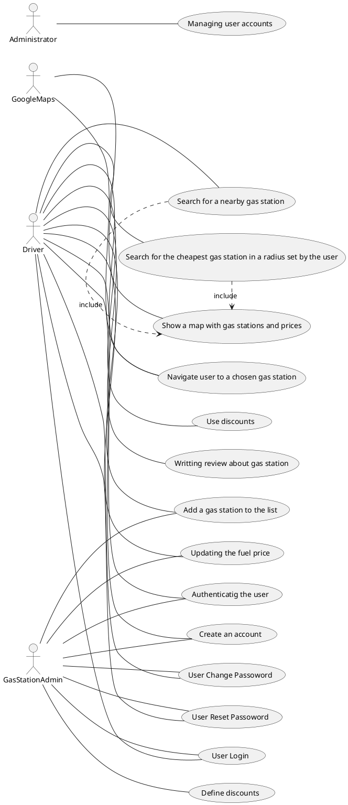
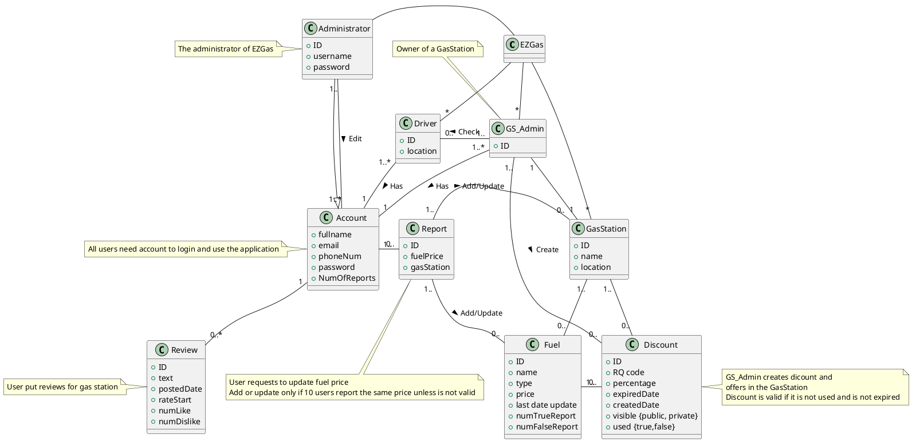
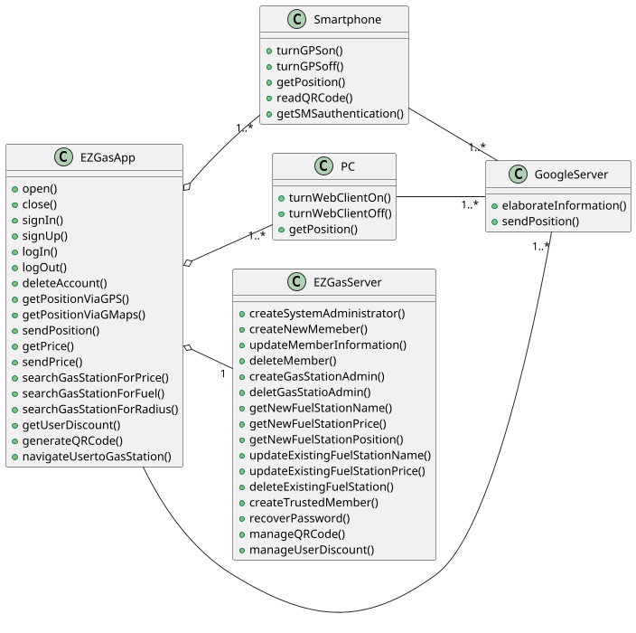
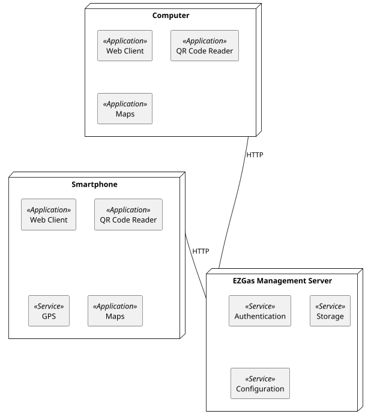

# Requirements Document 

Authors: Group 50

Date: 19 April

Version: 1

# Contents

- [Stakeholders](#stakeholders)
- [Context Diagram and interfaces](#context-diagram-and-interfaces)
	+ [Context Diagram](#context-diagram)
	+ [Interfaces](#interfaces) 
	
- [Stories and personas](#stories-and-personas)
- [Functional and non functional requirements](#functional-and-non-functional-requirements)
	+ [Functional Requirements](#functional-requirements)
	+ [Non functional requirements](#non-functional-requirements)
- [Use case diagram and use cases](#use-case-diagram-and-use-cases)
	+ [Use case diagram](#use-case-diagram)
	+ [Use cases](#use-cases)
    	+ [Relevant scenarios](#relevant-scenarios)
- [Glossary](#glossary)
- [System design](#system-design)
- [Deployment diagram](#deployment-diagram)


# Stakeholders

| Stakeholder name  | Description | 
| ----------------- |:-----------:|
|        Driver           |      Uses the application for checking the prices of fuels in different gas stations | 
|        Gas station administrator           |      Uses the application for updating the prices of the fuels        |
|        Developer           |      Develops the application        |
|        Administrator	           |      Application administrator, IT administrator, DB administrator     |


# Context Diagram and interfaces

## Context Diagram
```plantuml
left to right direction
actor Driver as a
actor GasStationAdmin as b
actor Administrator as c
actor GoogleMap as d

rectangle System {
a -- (Ez Gas Application)
b -- (Ez Gas Application)
c -- (Ez Gas Application)
d -- (Ez Gas Application)
}
```

## Interfaces

| Actor | Logical Interface | Physical Interface  |
| ------------- |:-------------:| -----:|
|    Driver   | GUI | Touch screen |
|    Gas station administrator   | GUI | Touch screen |
|    Google Maps   | Web Service | Internet connection |
|    Administrator   | GUI | Screen, Keyboard |

# Stories and personas
Peter is a plumber and travels a lot on his LPG van for work in differend towns, up to hundreds of kilometers a day. He knows all the best gas station on his usual routes but work sometimes takes in other cities he doesnt know very well. Peter pays attention to the price of LPG so he uses EzGas to find a cheap gas station with LPG in a 5 km range, or further but on his way home. One day he goes a bit out of his way to fill the tank on a very cheap gas station he found with EzGas, but when he gets there the actual price is higher than advertised so he reports it on the app and he will receive a discount for his contribution. After making a few true reports like that Peter becomes a trusted user.

Janice works in upper managment of a big company and drives a Porches. On tuesdays after work she has to pick up her son from piano practice, and is usually in a hurry. When she sees the gas tank almost empty she uses EzGas find the nearest gas station and doesn't care about the price because she is running late.

Frank just opened a gas station very close to a big intersection but not quite visible from the road, so he added his gas station in EzGas to advertise with offering discount. Many people come to his gas station with discount codes on their phones for a small reduction on the fuel, which is worth because of the many new clients he gets.

# Functional and non functional requirements

## Functional Requirements


| ID        | Description  |
| ------------- |:-------------:|  
|  FR1     | Searching for a nearby gas station ( using Google maps ) |
|  FR2     | Searching for the cheapest gas station ( for a certain type of fuel ) in a radius set by the user |
|  FR3     | Showing a map with gas stations and their prices |
|  FR4     | Navigate the user to a chosen gas station |
|  FR5     | Authenticatig the users (differentiating the gas station administrator and users as drivers) |
|  FR6     | Adding a gas station to the list |
|  FR7     | Updating the fuel price |
|  FR8     | Keeping track of the users' contributions and rights to discounts |
|  FR9     | Keeping track of earned discounts and allowing users to claim them at gas stations |
|  FR10    | Manageing accounts of the users |

## Non Functional Requirements


| ID        | Type (efficiency, reliability, ..)           | Description  | Refers to |
| ------------- |:-------------:| :-----:| -----:|
|  NFR1     | Portability | The app should be available for versions of Android > 5.0 and IOS > 4 | All FR |
|  NFR2     | Portability | The web version should work on the latest version of Chrome, Firefox, Safari, Edge and Opera | All FR |
|  NFR3     | Usability | The app should be intuitive to use and require no more than 5 or 6 help frames for an average smartphone user | All FR |
|  NFR4     | Usability(domain) | Core functions(search for gas station) should be done with 1-2 clicks because its used in a possibly moving car and should not distract too much | FR1, FR2 |
|  NFR5     | Performance | The search function should take no more that 2-3 seconds to display the first results and other function no more than 0.5 sec | All FR |

# Use case diagram and use cases


## Use case diagram



### Use case 1, UC1 - FR1, FR2, FR3 Selecting the most suitable gas station ( location and the cheapest fuel )
| Actors Involved        | Driver, GoogleMaps |
| ------------- |:-------------:| 
|  Precondition     | Gas Station G exists, Fuel F exists, Driver range location R exists |  
|  Post condition     | R>= G.location | G.fuel==F |
|  Nominal Scenario     | Driver selects the most suitable gas station to his/her preferences (location and the cheapest fuel) |
|  Variants     | There are not enough information about fuels |

### Use Case 2, UC2 - FR4 Navigate the user to a chosen gas station

| Actors Involved        | Driver, GoogleMaps |
| ------------- |:-------------:| 
|  Precondition     | Driver Location L exists, Gas Station G exists |  
|  Post condition     | L== G.location |
|  Nominal Scenario     | The GoogleMap gives the directions that the driver has to follow to arrive at the selected gas station | 
|  Variants     | Internet connection unstable |

### Use Case 3, UC3 - FR5 Authenticatig the users 

| Actors Involved        | Driver, Gas Station Administrator |
| ------------- |:-------------:| 
|  Precondition     | Driver/Gas Station Administrator account does not exist |  
|  Post condition     | Their respective accounts exists |
|  Nominal Scenario     | User enter valid user name, email, phone number, pasword and application detects if the user is driver or gas station administrator | 
|  Variants     | Email/Mobile  is not valid, forgot the password |

### Use Case 4, UC4 - FR6 Adding a gas station to the list 

| Actors Involved        | Driver, Gas Station Administrator |
| ------------- |:-------------:| 
|  Precondition     | Gas Station does not exist |  
|  Post condition     | Gas Station exists in the real world but is not on the GoogleMaps |
|  Nominal Scenario     | User adds a Gas Station which is not on the GoogleMaps | 
|  Variants     | Gas Station is already added in the application |

### Use Case 5, UC5 - FR7 Updating the fuel price

| Actors Involved        | Driver, Gas Station Administrator |
| ------------- |:-------------:| 
|  Precondition     | Fuel F exists, Gas Station G exists |  
|  Post condition     | G.fuel == F | F.oldPrice != F.newPrice |
|  Nominal Scenario     | Driver selects the gas station and checks if the price is correct or not, If It's not update it | 
|  Variants     | Selecting the wrong Gas Station |

### Use Case 6, UC6 - FR8 Keeping track of the users contributions and rights to discounts

| Actors Involved        | Driver, Gas Station Administrator |
| ------------- |:-------------:| 
|  Precondition     | Driver's information is correct|  
|  Post condition     | Gas Station Administrator creates discounts |
|  Nominal Scenario     | Gas Station Administrator checks if teh information is correcat and creates discounts | 
|  Variants     | Driver's information is not correct |

### Use Case 7, UC7 - FR9  Communicate discounts to gas station managers through QR code

| Actors Involved        | Driver, Gas Station Administrator |
| ------------- |:-------------:| 
|  Precondition     | Driver checks out for discounts in the Google Maps |  
|  Post condition     | Driver can use the discounts |
|  Nominal Scenario     | The Gas Station Administrator validate discount and minimize the price | 
|  Variants     | The discount has been used before or discount expired |

### Use Case 8, UC8 - FR10  Manage accounts of the users 

| Actors Involved        | Administrator |
| ------------- |:-------------:| 
|  Precondition     | Some information about the users is wrong |  
|  Post condition     | Correct the wrong information |
|  Nominal Scenario     | The Administrator of the application checks if there are wrong information and corrects it | 
|  Variants     | Everything is correct |

### Use Case 9, UC9 - FR11  Writting Review 

| Actors Involved        | Driver |
| ------------- |:-------------:| 
|  Precondition     | User login in the application |  
|  Post condition     | Select the gas station from Google maps |
|  Nominal Scenario     | The user write feedback about the gas station and rate its service | 
|  Variants     | User cannot save because of bad internet connection  |


# Relevant scenarios

## Scenario 1 - Select Gas Station

| Scenario 1 | Corresponds to UC1 |
| ------------- |:-------------:| 
| Description | Driver D selects the most suitable Gas Station G |
|  Precondition     | distance(G, D) <= D.range |
|  Post condition     | Driver selects a Gas Station |
| Step#        | Step description |
|  1     | Google Maps shows all the gas station inside the driver's range |  
|  2     | Driver selects the best gas station choices and compares fuel prices |
|  3     | Driver selects the desired gas station |

## Scenario 2 - Account

###Scenario 2.1 - Create account

| Scenario ID: SC2.1        | Corresponds to UC3 |
| ------------- |:-------------| 
| Description | User U (Driver or Gas Station Administrator) creates an account|
| Precondition | U uses for the first time their email |
| Postcondition | U creates the account |
| Step#        | Step description |
|  1     | User goes to EzGas application |  
|  2     | User registers as an user with an user name, email, phone number and password |
|  3     | User's email is validated |
|  4     | User creates an account |

###Scenario 2.2 - Not create account

| Scenario ID: SC2.2        | Corresponds to UC3 |
| ------------- |:-------------| 
| Description | User U (Driver or Gas Station Administrator) cannot create an account |
| Precondition | U uses the same email twice |
| Postcondition | U cannot create the account |
| Step#        | Step description |
|  1     | User goes to EzGas web page |  
|  2     | User registers as an user with an user name, email, phone number and pasword |
|  3     | User's email is not validated |
|  4     | User cannot create an account |

## Scenario 3 - Add Gas Station

| Scenario 3 | Corresponds to UC4 |
| ------------- |:-------------:| 
| Description | Driver D adds a Gas Station G to the list |
|  Precondition     | Gas Station is not in the Google maps |
|  Post condition     | Gas Station is not in the Google maps |
| Step#        | Step description |
|  1     | Driver sees a Gas Station that is not in the application Google maps |  
|  2     | Driver logs in the application |
|  3     | Driver adds the Gas Station |
|  4     | Driver saves the information |


## Scenario 4 - Update fuel price

### Scenario 4.1 - Valid price

| Scenario ID: SC4.1        | Corresponds to UC5 |
| ------------- |:-------------| 
| Description | Driver D updates a fuel's price F |
| Precondition | D.fuelPrice != F.price |
| Postcondition | D.fuelPrice == F.price && D.goodInfo ++ |
| Step#        | Step description |
|  1     | Driver login into the application |  
|  2     | Driver selects the wrong fuel and the gas station where it is |
|  3     | Driver update the price |
|  4     | Users check if the price is correct |
|  5     | If the price reaches to 10 votes then It's valid price |

### Scenario 4.2 - Invalid price

| Scenario ID: SC4.2        | Corresponds to UC5 |
| ------------- |:-------------| 
| Description | Driver D cannot update a fuel's price F |
| Precondition | D.fuelPrice != F.price |
| Postcondition | D.fuelPrice != F.price && D.wrongInfo ++ |
| Step#        | Step description |
|  1     | Driver login into the application |  
|  2     | Driver selects the wrong fuel and the gas station where it is |
|  3     | Driver updates the price |
|  4     | Users check the fuel price, if It's correct they don't change it, but if it is wrong driver update it|
|  5     | If the price does not reache to 10 votes then it will not be updated |

## Scenario 5 - Create discount

| Scenario ID: SC5         | Corresponds to UC6 |
| ------------- |:-------------| 
| Description | Create a discount |
| Precondition | Driver gives right information |
| Postcondition | Gas Station Administrator creates discounts to all users|
| Step#        | Step description |
|  1     | Gas Station Administrator defines the percentage of discount, type of fuel and the expired date|  
|  2     | The discount will be show to all users on the Google maps if they filter|

## Scenario 6 - Use discount

| Scenario ID: SC6        | Corresponds to UC7 |
| ------------- |:-------------| 
| Description | Validate discount |
| Precondition | There are discounts in the Gas Station |
| Postcondition | Driver uses discounts |
| Step#        | Step description |
|  1     | Driver shows discount's QR code |  
|  2     | Gas Station Administrator checks if it is valid |
|  3     | Gas Station Administrator reduces Driver's price and makes the discount used |


# Glossary




# System Design

Since EzGas Application is meant to be a software application, we focus our attention on the software part rather than the hardware part.
The goal here is to describe in a clear and complete manner the system behavior and all its functionalities performed, through UML Class Diagram notation.




# Deployment Diagram 

Deployment Diagram, represented here, aims to show conceptual entities (applications and services) defined before from another point of view, based on UML Deployment Diagram notation.



| Node        | Linked to node           | Description  |
| ------------- |:-------------:| -----:|
| Computer      |  EZGas Management Server| Connection is established via a HTTP logical link |
| Smartphone | EZGas Management Server  | Connection is established via a HTTP logical link |

| Stereotype (type of entity)    | Description   |
| ------------- |-------------:|
| Application   | A group of services visible to end-user |
| service       | An end-user or middleware service      |
