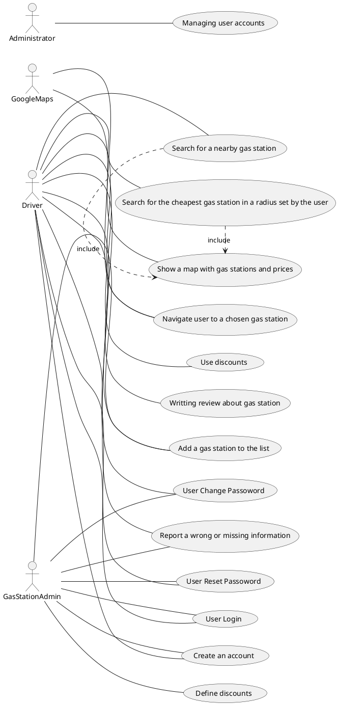
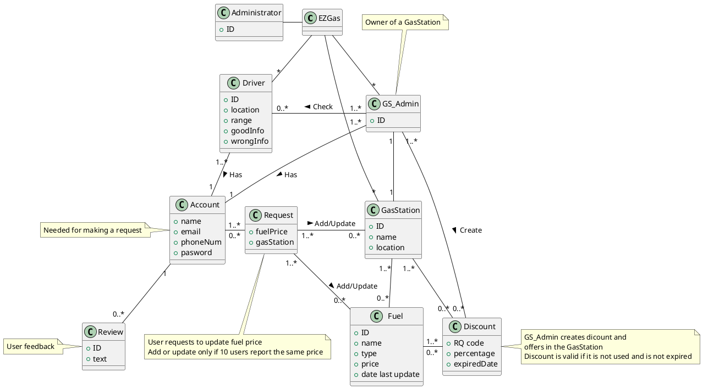

# Requirements Document 

Authors:

Date:

Version:

# Contents

- [Stakeholders](#stakeholders)
- [Context Diagram and interfaces](#context-diagram-and-interfaces)
	+ [Context Diagram](#context-diagram)
	+ [Interfaces](#interfaces) 
	
- [Stories and personas](#stories-and-personas)
- [Functional and non functional requirements](#functional-and-non-functional-requirements)
	+ [Functional Requirements](#functional-requirements)
	+ [Non functional requirements](#non-functional-requirements)
- [Use case diagram and use cases](#use-case-diagram-and-use-cases)
	+ [Use case diagram](#use-case-diagram)
	+ [Use cases](#use-cases)
    	+ [Relevant scenarios](#relevant-scenarios)
- [Glossary](#glossary)
- [System design](#system-design)
- [Deployment diagram](#deployment-diagram)

# Stakeholders

| Stakeholder name  | Description | 
| ----------------- |:-----------:|
|                   |             | 

# Context Diagram and interfaces

## Context Diagram
\<Define here Context diagram using UML use case diagram>

\<actors are a subset of stakeholders>

## Interfaces
\<describe here each interface in the context diagram>

\<GUIs will be described graphically in a separate document>

| Actor | Logical Interface | Physical Interface  |
| ------------- |:-------------:| -----:|
|       |  |  |

# Stories and personas
\<A Persona is a realistic impersonation of an actor. Define here a few personas and describe in plain text how a persona interacts with the system>

\<Persona is-an-instance-of actor>

\<stories will be formalized later as use cases>

# Functional and non functional requirements

## Functional Requirements

\<In the form DO SOMETHING, or VERB NOUN, describe high level capabilities of the system>

\<will match to high level use cases>

| ID        | Description  |
| ------------- |:-------------:| 
|  FR1     |  |
|  FR2     |   |

## Non Functional Requirements

\<Describe constraints on functional requirements>

| ID        | Type (efficiency, reliability, ..)           | Description  | Refers to |
| ------------- |:-------------:| :-----:| -----:|
|  NFR1     |   |  | |
|  NFR2     | |  | |
|  NFR3     | | | |

# Use case diagram and use cases

## Use case diagram
\<define here UML Use case diagram UCD summarizing all use cases, and their relationships>

\<next describe here each use case in the UCD>
### Use case 1, UC1 - FR1, FR2, FR3 Selecting the most suitable gas station ( location and the cheapest fuel )
| Actors Involved        | Driver, GoogleMaps |
| ------------- |:-------------:| 
|  Precondition     | Gas Station G exists, Fuel F exists, Driver range location R exists |  
|  Post condition     | R>= G.location | G.fuel==F |
|  Nominal Scenario     | Driver selects the most suitable gas station to his/her preferences (location and the cheapest fuel) |
|  Variants     | There are not enough information about fuels |

### Use Case 2, UC2 - FR4 Navigate the user to a chosen gas station

| Actors Involved        | Driver, GoogleMaps |
| ------------- |:-------------:| 
|  Precondition     | Driver Location L exists, Gas Station G exists |  
|  Post condition     | L== G.location |
|  Nominal Scenario     | The application gives the directions that the driver has to follow to arrive at the gas station selected | 
|  Variants     | There are not good internet connection |

### Use Case 3, UC3 - FR5 Authenticatig the users 

| Actors Involved        | Driver, Gas Station Administrator |
| ------------- |:-------------:| 
|  Precondition     | Driver/ Gas Station Administrator account does not exist |  
|  Post condition     | Their respective accounts exists |
|  Nominal Scenario     | User interts valid user name, email, phone number, pasword and specify if they are drivers or gas station administrator | 
|  Variants     | Email is already used or not valid, forgot the pasword |

### Use Case 4, UC4 - FR6 Adding a gas station to the list 

| Actors Involved        | Driver, Gas Station Administrator |
| ------------- |:-------------:| 
|  Precondition     | Gas Station does not exist |  
|  Post condition     | Gas Station exists |
|  Nominal Scenario     | User adds a Gas Station which is not in the application | 
|  Variants     | Gas Station is already in the application |

### Use Case 5, UC5 - FR7 Reporting a wrong or missing information

| Actors Involved        | Driver, Gas Station Administrator |
| ------------- |:-------------:| 
|  Precondition     | Fuel F exists, Gas Station G exists |  
|  Post condition     | G.fuel == F | F.oldPrice != F.newPrice |
|  Nominal Scenario     | Driver selects the wrong fuel and the gas station where the fuel is and updates its value, Users validate the information | 
|  Variants     | Wrong information |

### Use Case 6, UC6 - FR8 Keeping track of the users contributions and rights to discounts

| Actors Involved        | Driver, Gas Station Administrator |
| ------------- |:-------------:| 
|  Precondition     | Driver's information is correct|  
|  Post condition     | Gas Station Administrator creates discounts |
|  Nominal Scenario     | Gas Station Administrator checks if teh information is correcat and creates discounts | 
|  Variants     | Driver's information is not correct |

### Use Case 7, UC7 - FR9  Communicate discounts to gas station managers through QR code

| Actors Involved        | Driver, Gas Station Administrator |
| ------------- |:-------------:| 
|  Precondition     | Driver checks out for discounts in the map |  
|  Post condition     | Driver can use the discounts |
|  Nominal Scenario     | The Gas Station Administrator validate discount and minimize the price | 
|  Variants     | The discount has been used before or discount expired |

### Use Case 8, UC8 - FR10  Manage accounts of the users |

| Actors Involved        | Administrator |
| ------------- |:-------------:| 
|  Precondition     | Some information about the users is wrong |  
|  Post condition     | Correct the wrong information |
|  Nominal Scenario     | The Administrator of the application checks if there are wrong information and corrects it | 
|  Variants     | Everything is correct |

# Relevant scenarios

## Scenario 1 - Select Gas Station

\<describe here scenarios instances of UC1>

\<a scenario is a sequence of steps that corresponds to a particular execution of one use case>

\<a scenario is a more formal description of a story>

\<only relevant scenarios should be described>

| Scenario 1 | Corresponds to UC1 |
| ------------- |:-------------:| 
| Description | Driver D selects the most suitable Gas Station G |
|  Precondition     | distance(G, D) <= D.range |
|  Post condition     | Driver selects a Gas Station |
| Step#        | Step description |
|  1     | GoogleMaps shows all the gas station inside the driver's range |  
|  2     | Driver selects the best gas station choices and compares fuel prices |
|  3     | Driver selects the desired gas station |

## Scenario 2 - Account

###Scenario 2.1 - Create account

| Scenario ID: SC2.1        | Corresponds to UC3 |
| ------------- |:-------------| 
| Description | User U (Driver or Gas Station Administrator) creates an account|
| Precondition | U uses for the first time their email |
| Postcondition | U creates the account |
| Step#        | Step description |
|  1     | User goes to EzGas application |  
|  2     | User registers as an user with an user name, email, phone number and pasword |
|  3     | User's email is validated |
|  4     | User creates an account |

###Scenario 2.2 - Not create account

| Scenario ID: SC2.2        | Corresponds to UC3 |
| ------------- |:-------------| 
| Description | User U (Driver or Gas Station Administrator) cannot create an account |
| Precondition | U uses the same email twice |
| Postcondition | U cannot create the account |
| Step#        | Step description |
|  1     | User goes to EzGas web page |  
|  2     | User registers as an user with an user name, email, phone number and pasword |
|  3     | User's email is not validated |
|  4     | User cannot create an account |

## Scenario 3 - Add Gas Station

| Scenario 3 | Corresponds to UC4 |
| ------------- |:-------------:| 
| Description | Driver D adds a Gas Station G to the list |
|  Precondition     | Gas Station is not in the map |
|  Post condition     | Gas Station is not in the map |
| Step#        | Step description |
|  1     | Driver sees a Gas Station that is not in the application map |  
|  2     | Driver logs in the application |
|  3     | Driver adds the Gas Station |
|  4     | Driver saves the information |

## Scenario 4 - Update fuel price

### Scenario 4.1 - Correct information

| Scenario ID: SC4.1        | Corresponds to UC5 |
| ------------- |:-------------| 
| Description | Driver D updates a fuel's price F |
| Precondition | D.fuelPrice != F.price |
| Postcondition | D.fuelPrice == F.price && D.goodInfo ++ |
| Step#        | Step description |
|  1     | Driver logs in the application |  
|  2     | Driver selects the wrong fuel and the gas station where it is |
|  3     | Driver changes the price and saves it |
|  4     | Users check if it is correct, validate it and Driver obtains a point of good information |
|  5     | If Driver has iqual or more 10 points of good information, Driver becomes to be a trusted user |

### Scenario 4.2 - Incorrect information

| Scenario ID: SC4.2        | Corresponds to UC5 |
| ------------- |:-------------| 
| Description | Driver D cannot update a fuel's price F |
| Precondition | D.fuelPrice != F.price |
| Postcondition | D.fuelPrice != F.price && D.wrongInfo ++ |
| Step#        | Step description |
|  1     | Driver logs in the application |  
|  2     | Driver selects the wrong fuel and the gas station where it is |
|  3     | Driver changes the price and saves it |
|  4     | Users check if it is correct, don't validate it and Diver obtains a point of wrong information|
|  5     | If Driver has more or equal 5 negative points, it will be baned |

## Scenario 5 - Create discount

| Scenario ID: SC5         | Corresponds to UC6 |
| ------------- |:-------------| 
| Description | Create a discount |
| Precondition | Driver gives right information |
| Postcondition | Gas Station Administrator creates discounts |
| Step#        | Step description |
|  1     | Gas Station Administrator validates Driver's information |  
|  2     | Gas Station Administrator creates discounts |

## Scenario 6 - Use discount

| Scenario ID: SC6        | Corresponds to UC7 |
| ------------- |:-------------| 
| Description | Validate discount |
| Precondition | There are discounts in the Gas Station |
| Postcondition | Driver uses discounts |
| Step#        | Step description |
|  1     | Driver shows discount's QR code |  
|  2     | Gas Station Administrator checks if it is valid |
|  3     | Gas Station Administrator reduces Driver's price and makes the discount disable |

# Glossary

\<use UML class diagram to define important concepts in the domain of the system, and their relationships> 

\<concepts are used consistently all over the document, ex in use cases, requirements etc>

# System Design
\<describe here system design>

\<must be consistent with Context diagram>

# Deployment Diagram 

\<describe here deployment diagram >
